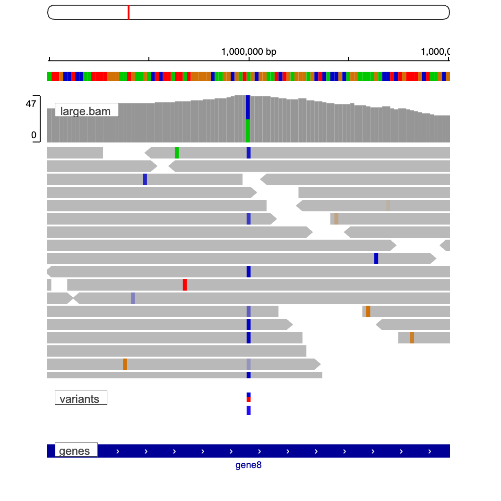
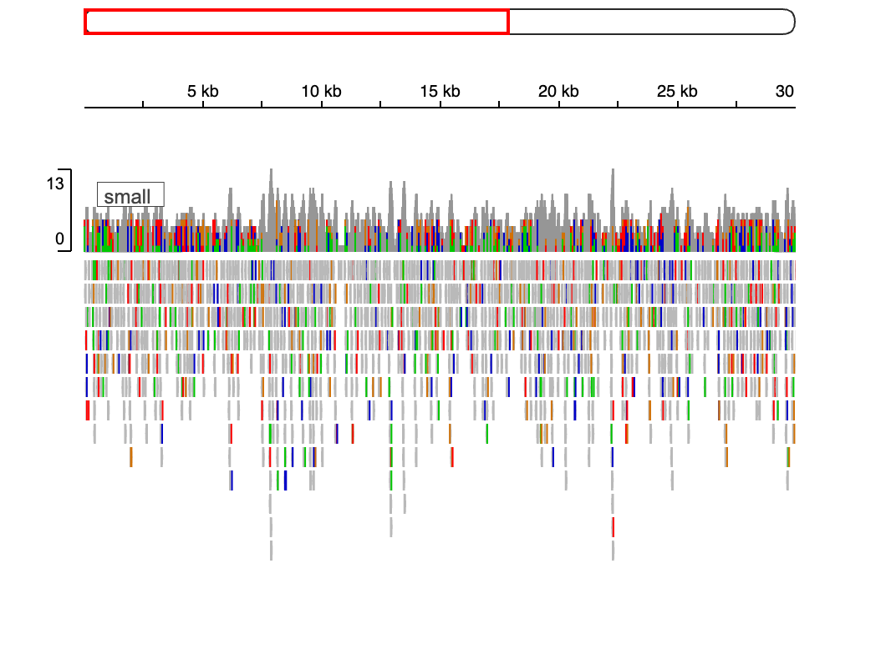

# IGV Viewer for VS Code (unofficial)

This is an unofficial, community project that embeds the [igv.js](https://github.com/igvteam/igv.js) genome browser in Visual Studio Code. It is not affiliated with or endorsed by the IGV team at the Broad Institute or UC San Diego.

View alignments, coverage, variants, annotations and reference sequence next to your code, on desktop VS Code, Remote-SSH, Dev Containers and code-server (including hosted platforms such as CodeOcean). AI agents get the same controls through a CLI and an MCP server, and can look at what is shown.



## Highlights

- **Open any genomic file**: BAM, CRAM, VCF, bigWig, bigBed, TDF, BED, GFF/GTF, bedGraph, WIG, SEG, MAF, bedpe, FASTA/2bit references, `.igv.json` sessions. Double-click binary formats; right-click text formats.
- **Large files stream.** Indexed formats are read by byte range around the view. Unindexed large files are never loaded silently: you are offered to index, compress+index, subsample, or load anyway, with the exact `samtools`/`tabix` command shown.
- **Runs where your files are.** No HTTP server, no open port: the viewer reads through a per-viewer allow-list in the extension host, so it works identically on a laptop and on locked-down code-server hosts.
- **Remote data** by URL, directly from the browser or proxied through the extension host when servers lack CORS or Range support.
- **Sessions you can commit**: `.igv.json` with paths relative to the file.
- **Agent-first**: the `igv-vscode` CLI and an MCP server (`igv_open`, `igv_goto`, `igv_snapshot` returns the image) with a ready-made Claude Code skill.
- **Genome mismatch detection**, status-bar locus, "Go to Locus from Selection" from any editor (locus strings, VCF/BED/GFF/SAM lines, gene names), PNG/SVG export, restore after reload.

## Install

Until it is published, install the VSIX from the [releases](https://github.com/AllenInstituteSeaHub/igv-vscode/releases):

```sh
code --install-extension igv-vscode-<version>.vsix
```

Reload the window afterwards.

## Open a BAM in under a minute

1. Double-click a `.bam` in the Explorer. Pick a genome when asked (`hg38`, `mm10`, … from the bundled list, or **Local FASTA or 2bit file…** for your own reference). The viewer opens where the reads are.
2. Right-click more files → **Add to Viewer** (multi-select works), or type a locus in **Go to Locus…**; the status bar shows where you are.
3. **Save Session…** writes an `.igv.json` you can commit. **Export Snapshot…** writes a PNG or SVG.



Settings live under `igv.*` (see [docs/settings.md](docs/settings.md)). Set `igv.defaultGenome` to skip the genome question.

## Claude Code and other agents

1. Run **IGV: Copy MCP Setup Command** and paste the result into a terminal:

   ```sh
   claude mcp add igv -- '<absolute launcher path>' mcp
   ```

2. Run **IGV: Add Agent Skill to Workspace** (writes `.claude/skills/igv/SKILL.md`).
3. Ask Claude: *"Open sample.bam on hg38 at chr17:7,668,402-7,687,550 and tell me what you see."* It opens a viewer beside your editor, takes a snapshot, and reads it.

From any VS Code terminal the CLI is on PATH:

```sh
igv-vscode open --genome hg38 --locus chr17:7,668,402-7,687,550 tumor.bam normal.bam
igv-vscode goto TP53
igv-vscode snapshot --out view.png
igv-vscode state --json
```

Output is JSON when piped. Coordinates are 1-based, inclusive. Details, the MCP tool list and troubleshooting: [docs/agents.md](docs/agents.md). The control channel is a local, token-authenticated socket; it is off in Restricted Mode and when `igv.agent.enabled` is false.

## Large and remote files

Indexed formats (BAM+BAI, CRAM+CRAI, bgzipped text + TBI/CSI, bigWig, bigBed, TDF) stream by byte range. For an unindexed BAM or text file above `igv.largeFile.unindexedMaxBytes` (20 MiB) you choose: index with samtools/tabix, sort + bgzip + tabix, subsample, or load anyway. Tools are found on PATH or via `igv.tools.paths`; generated files go next to the source when writable, else into `igv.largeFile.derivedDir`. Agents get `INDEX_REQUIRED` with the exact command and can pass `--auto-index`.

`https://` URLs are fetched by the viewer directly (server needs CORS + Range). Set `igv.remote.mode` to `proxy` to fetch through the extension host (bypasses browser CORS and uses the host's network) or `auto` to fall back to the proxy. `s3://` and `gs://` need presigned HTTPS URLs for now.

## code-server and CodeOcean

Install once in the capsule's post-install script so it persists:

```bash
if command -v code-server >/dev/null; then
  mkdir -p /.vscode/extensions
  curl -fsSL -o /tmp/igv-vscode.vsix https://github.com/AllenInstituteSeaHub/igv-vscode/releases/latest/download/igv-vscode.vsix
  code-server --extensions-dir=/.vscode/extensions --install-extension /tmp/igv-vscode.vsix
fi
```

Notes: `/data` is read-only, so generated indexes go to `igv.largeFile.derivedDir` (set it to `/results` or your workspace to keep them). Remote URLs in `direct` mode are fetched by your browser, in `proxy` mode by the capsule. No system Node is needed for the CLI: its launcher uses code-server's own runtime.

## Documentation

- [docs/agents.md](docs/agents.md): CLI, MCP, Claude Code setup
- [docs/settings.md](docs/settings.md): every setting and command
- [docs/errors.md](docs/errors.md): error codes and hints
- [docs/troubleshooting.md](docs/troubleshooting.md)
- [docs/RELEASING.md](docs/RELEASING.md): versioning and publishing
- [docs/architecture.md](docs/architecture.md), [docs/DECISIONS.md](docs/DECISIONS.md), [PROGRESS.md](PROGRESS.md)

## Development

```sh
npm install
npm run build             # vendors igv.js + the genome list, bundles extension/webview/cli
npm run check             # typecheck + lint + unit tests
npm run test:integration  # launches VS Code (needs network + fixtures)
npm run test:contract     # Playwright: pins igv.js behaviour we depend on
npm run package           # builds the VSIX

# fixtures (once): python3 -m venv .venv && .venv/bin/pip install pysam pyBigWig numpy && .venv/bin/python scripts/make-fixtures.py
```

Press F5 to launch an Extension Development Host. Releases: see [docs/RELEASING.md](docs/RELEASING.md).

## Citation

If you use this extension in published work, please cite igv.js and IGV:

- Robinson JT, Thorvaldsdóttir H, Turner D, Mesirov JP. igv.js: an embeddable JavaScript implementation of the Integrative Genomics Viewer (IGV). *Bioinformatics*. 2023;39(1):btac830. https://doi.org/10.1093/bioinformatics/btac830
- Robinson JT, Thorvaldsdóttir H, Winckler W, et al. Integrative genomics viewer. *Nature Biotechnology*. 2011;29(1):24–26.

## License

MIT. igv.js is bundled unmodified under its own MIT license.
